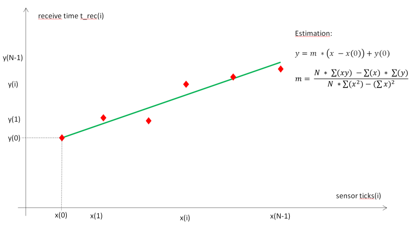

# SoftwarePLL

Software PLL for synchronisation between ticks and timestamps.

## Introduction

Many sensor devices, e.g. lidar devices, provide sensor data with timestamps. These timestamps can be synchronized with
the current system time by additional hardware, e.g. by GPS. But without specialized hardware, sensor timestamps and 
system time is normally unsynchronized. Sensor timestamps are often quite accurate, but have a different time base and 
a bias to the system time or to other sensor clocks. This difference is estimated and compensated by this Software PLL.

To compensate the different time base and bias between sensor and system clock, the system time when receiving sensor data 
is gathered together with the sensor timestamp. While the system time is often measured in seconds resp. nanoseconds, 
the sensor timestamp is normally received in clock ticks. SoftwarePLL estimates the correlation between system time in 
seconds/nanoseconds and sensor ticks, and computes a corrected time from ticks. This way you know at which time stamp the data 
have been measured by your sensor. 

SoftwarePLL is a generic module and independant from specific sensor types. It just uses the system timestamps and ticks,
estimates their correlation and predicts the time from sensor ticks. See [timing.md](timing.md) for an application
example using SICK laser scanner https://github.com/SICKAG/sick_scan. 

## How Software PLL works

SoftwarePLL computes a linear regression between ticks and system timestamps. The system time is measured immediately 
after receiving new sensor data, while sensor ticks represent the sensor clock at the time of measurement. Thus we have
three different times for each measurement:

- The time when the system receives the sensor data (receive time t_rec), measured in seconds resp. nanoseconds.  

- The sensor ticks (or just ticks) at the time of the measurement. These ticks are contained in the sensor data and 
received later by the system.

- The time of the measurement (measurement time t_mea). We don't know this time yet, but we estimate it from both the ticks 
and their receive time t_rec using the SoftwarePLL.

During initialization, ticks and system timestamps are stored in fifo buffer (first-in, first-out). After initialization, 
typically after N=7 measurements, a regression line is computed, i.e. the slope `m` (gradient) of a function 
`f(ticks) = m * ticks + c` is estimated from ticks `x(i)` and timestamps `y(i)` by a linear regression
`m = (N * sum(x(i) * y(i)) - sum(x(i)) * sum(y(i))) / (N * sum(x(i) * x(i)) - sum(x(i))*sum(x(i)))` with `0 <= i < N` and
unbiased values `x(i) = tick(i) - tick(0)`, `y(i) = t_rec(i) - t_rec(0)`.



The estimated system time `t_esti(i)` of a measurement can be computed from its sensor tick by `t_esti(i) = m * (ticks(i) - ticks(0)) + t_rec(0)`.
If the difference between estimated times `t_esti(i)` and the measured system timestamps `t_rec(i)` is small (typically 
less than 100 milliseconds), the estimation can be considered to be valid. With a valid estimation of `m`, we can
get a corrected timestamp for new measurements by applying function `SoftwarePLL::GetCorrectedTimeStamp`, which returns
the estimated system time of a measurement `t_esti  = m * (ticks - ticks(0)) + t_rec(0)`.

If the estimation is not valid (i.e. the difference between estimated times and measured system timestamps in the buffer is 
significant), we can't estimate system timestamps from sensor ticks. If this happens more than a given number of times
after initialization (typically 20 times), the fifo is reset and a new initialization is done.

## Source code example

Use the following code snippet as an example:

```
#include "softwarePLL.h"

// Create an instance of SoftwarePLL
SoftwarePLL& software_pll = SoftwarePLL::Instance("Sensor1");

// Get system time t_rec in seconds and nanoseconds when receiving sensor data
ros::Time t_rec = ros::Time::now();
uint32_t sec = t_rec.nsec;
uint32_t nanosec = t_rec.nsec;

// Get sensor ticks from sensor data
uint32_t ticks = scanner_msg.ticks;

// Update SoftwarePLL
software_pll.UpdatePLL(sec, nanosec, ticks);

// Get corrected timestamp (time of measurement from ticks)
software_pll.GetCorrectedTimeStamp(sec, nanosec, ticks);
```
